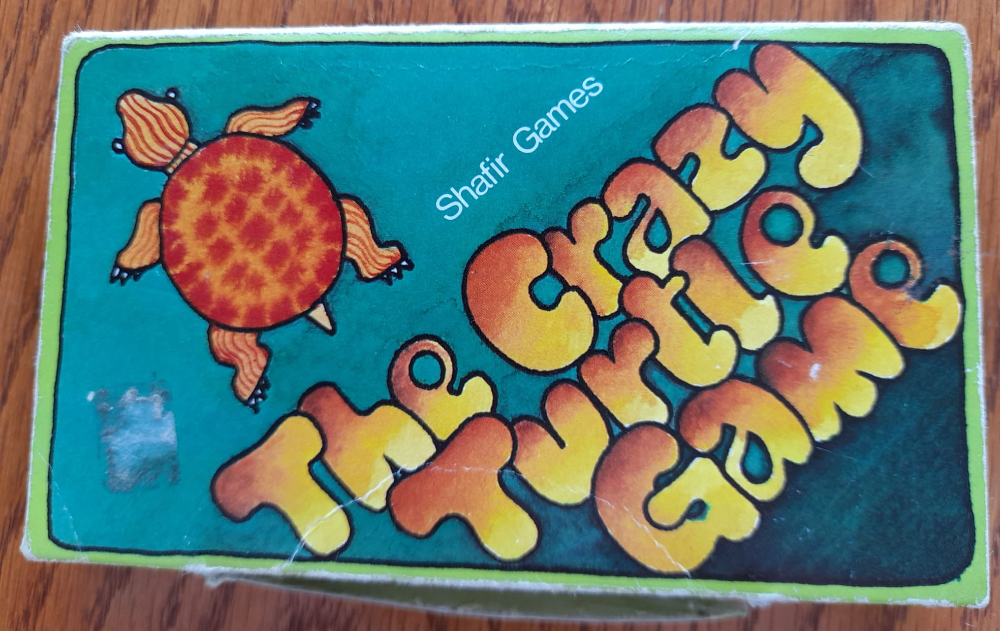
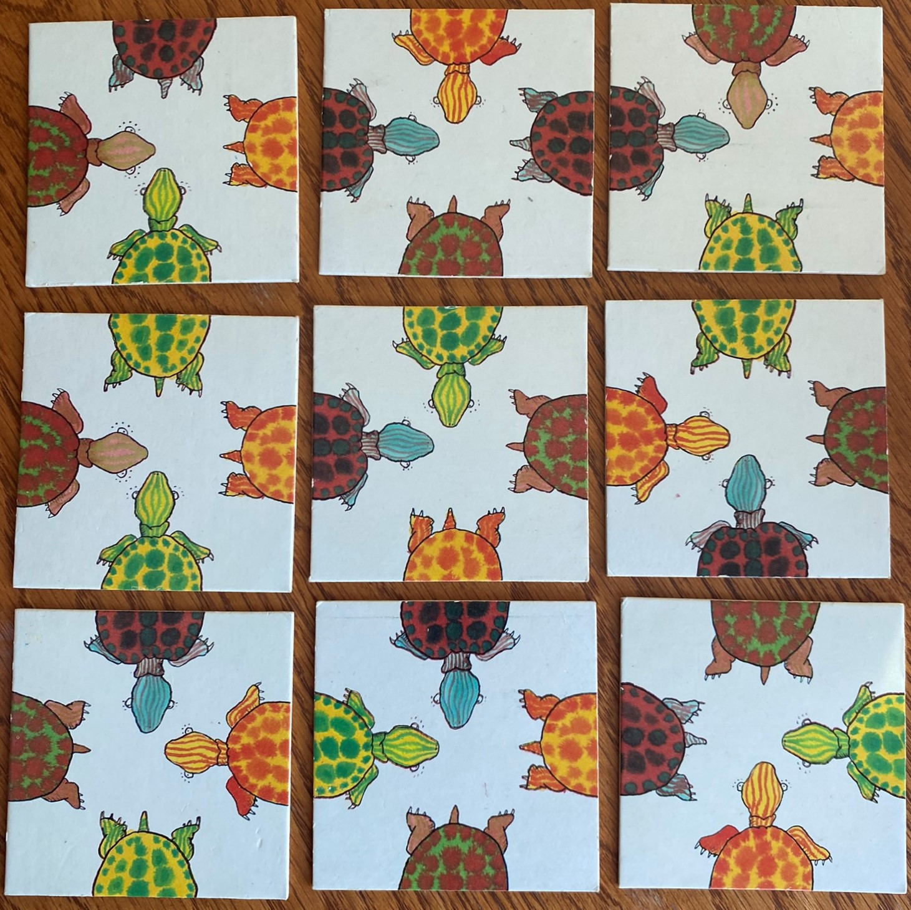
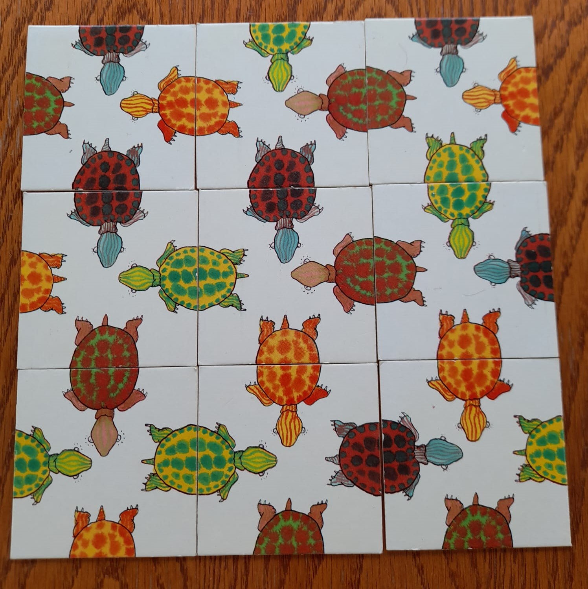
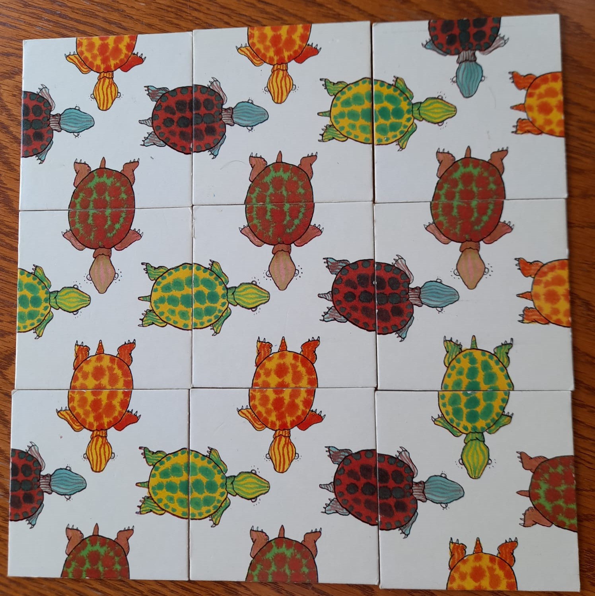

#  The Crazy Turtle Card Game Solver

[](https://www.python.org/)


[](./license.md) [](https://github.com/psf/black)

## Overview



The aim of the game is to arrange the 9 cards so that all the heads
and tails are matching. Sounds simple, apart from there are 23 billion
permutations and only two valid solutions. We own the 1979 version of
the game, and unsurprisingly, had never found a solution.



## Algorithm

The solver uses a depth first approach to finding solutions. For each
permutation of the 9 cards in a 3x3 grid, the solver starts in the top
left, rotating the top middle card until it matches, then starts rotating 
the top right card to find an match, and so forth until the bottom right
card matches - at which a solution is declared. Only successful permuations
and rotations sequences are continued, with other paths ignored to reduce
the search space.

The solver algorithm generates 16 solutions, which are the four solutions
viewed from the 4 angles of rotation. Of these four solutions, two are
repeats, since two cards in the game are identical. When all these
duplicates are removed, the game has just two solutions.

With the help of Python's multiprocessing Pool, the solver finds the 
two solutions in around 5 seconds.

## Installation

Clone the repo
```
git clone https://github.com/pjd199/crazy_turtle
```

## Usage

From the command line, run
```
python crazy_turtle.py
```
```
Solving The 'Crazy Turle' Game
................
Found 2 unique solutions in 5.30s.

Solution 1
['RH', 'OH', 'RT', 'BT'] : ['GH', 'BH', 'RT', 'OT'] : ['RH', 'OH', 'GT', 'BT']
['RH', 'GH', 'BT', 'OT'] : ['RH', 'BH', 'OT', 'GT'] : ['GH', 'RH', 'OT', 'BT']
['BH', 'GT', 'OT', 'GH'] : ['OH', 'RT', 'BT', 'GH'] : ['OH', 'GT', 'BT', 'RH']

Solution 2
['OH', 'RT', 'BT', 'RH'] : ['OH', 'GT', 'BT', 'RH'] : ['RH', 'OT', 'BT', 'GH']
['BH', 'GT', 'OT', 'GH'] : ['BH', 'RT', 'OT', 'GH'] : ['BH', 'OT', 'GT', 'RH']
['OH', 'GT', 'BT', 'RH'] : ['OH', 'RT', 'BT', 'GH'] : ['GH', 'BT', 'OT', 'RH']
key:
colours   - Orange, Green, Brown, Red
body part - Head, Tail
```

## Test

From the command line, run
```
pytest test_crazy_turtle.py
```

## Solutions

### First Solution



### Second Solution



## Licence

Solver distributed under the MIT License. See [LICENCE.md](LICENSE.md) for more information.

## Author

Pete Dibdin